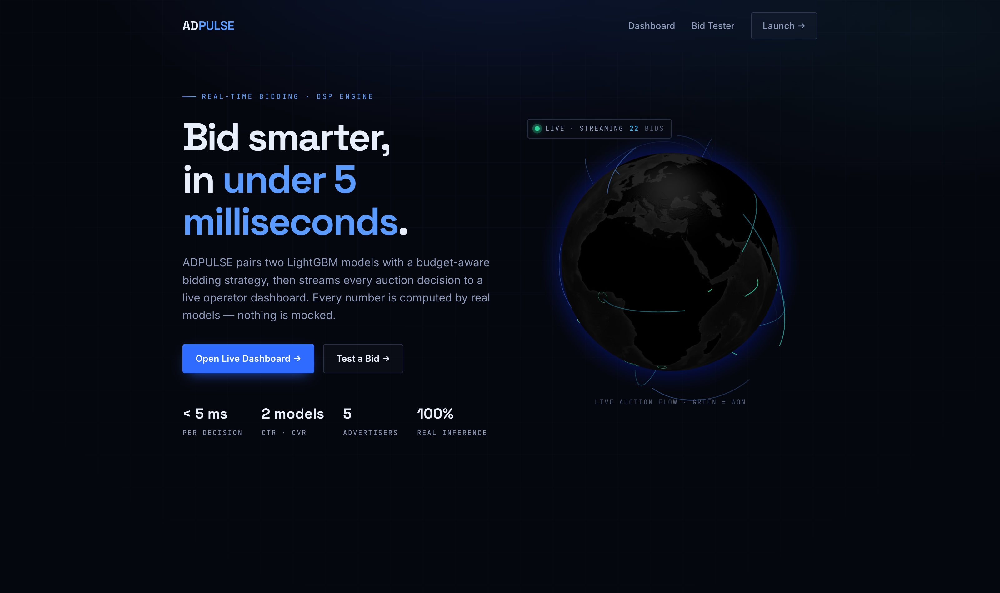
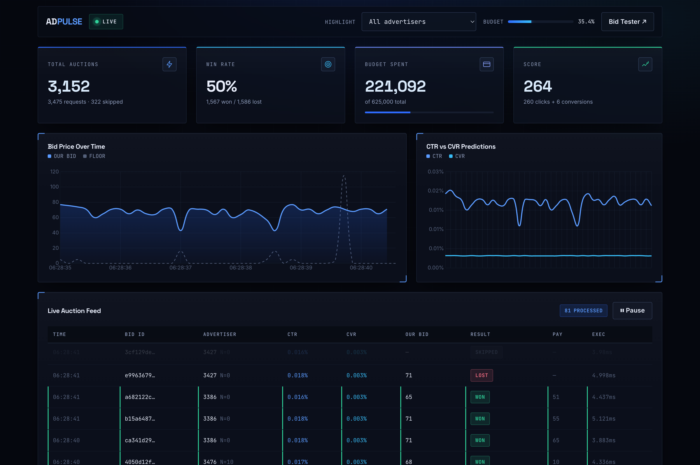
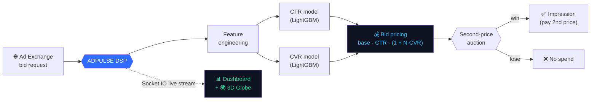
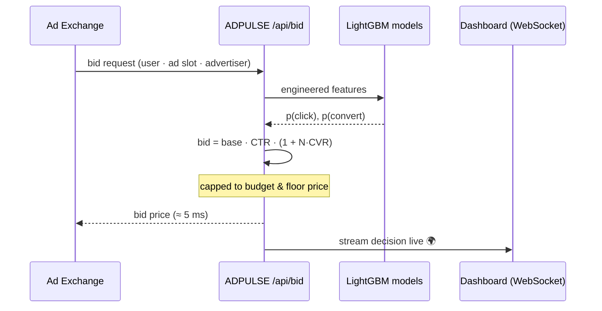

<div align="center">

# 📈 ADPULSE

### Real-Time Bidding intelligence — bid smarter, in under 5 milliseconds.

A full-stack **Demand-Side Platform (DSP)** that pairs two **LightGBM** models with a budget-aware
bidding strategy and streams every auction decision to a **live operator dashboard** with an
interactive **3D RTB globe**. Every number is computed by real models — nothing is mocked.

<br/>

[](https://adpulse-5r4y.onrender.com)
&nbsp;
[](https://adpulse-5r4y.onrender.com/dashboard)
&nbsp;
[](https://adpulse-5r4y.onrender.com/bidtester)

<br/>

[](https://github.com/alirizzzv/ADPULSE/actions/workflows/ci.yml)


</div>

---

## 📸 Screenshots

**Landing — interactive 3D RTB globe** (live bid flow streamed over WebSocket)



**Live operator dashboard** — real-time KPIs, bid-price & CTR/CVR charts, and a streaming auction feed



---

## 🎯 What is this?

Every time a webpage loads, a **millisecond auction** happens behind the scenes for the ad slot. ADPULSE is the **bidder** in that auction: for each incoming request it must decide — in real time, under a fixed budget — **whether to bid and how much**. It does this by predicting the probability of a click and a conversion with machine learning, then pricing the bid to maximise advertiser value.

> **The hard part isn't the ML — it's doing it in single-digit milliseconds, under a budget, at the scale of a live auction stream, without ever running out of memory.**

### How RTB Works

Real-Time Bidding (RTB) is an advanced programmatic advertising method that auctions ad impressions in real time as a user loads a webpage or app. The flow involves three key actors:

- **Ad Exchange** — the marketplace. It collects details about each available ad slot (size, URL, audience signals like IP address or cookie ID) and sends a **bid request** to all connected DSPs simultaneously.
- **Demand-Side Platform (DSP)** — represents advertisers. On receiving a bid request, a DSP evaluates whether the slot matches an advertiser's targeting criteria, decides whether to bid, calculates the optimal price, and fires a **bid response** back within milliseconds.
- **Auction** — the Ad Exchange ranks all bid responses. The highest bidder wins; their ad is shown to the user.

**ADPULSE is the DSP layer** — the part that does the thinking.

---

## ✨ Highlights

- 🧠 **Two real LightGBM models** predict click-through rate (CTR) and conversion rate (CVR) per request.
- ⚡ **~5 ms bid decisions** — models loaded once at startup, zero DB calls in the hot path.
- 🌍 **Interactive 3D RTB globe** (Three.js / globe.gl) that visualises live bid flow in real time over WebSocket.
- 📊 **Live operator dashboard** — win rate, budget burn-down, CTR/CVR trends, and a streaming auction feed.
- 🧪 **Bid Tester** — fire a synthetic request and watch the full decision break down term-by-term.
- 🌊 **O(1)-memory streaming** of the multi-GB IPinYou logs — never loads a file into RAM.
- 🎚️ **Graceful degradation** — runs on the real dataset when present, falls back to a synthetic generator otherwise (so it deploys anywhere with zero data setup).
- 🐳 **Containerised & deployed** — one Dockerfile, one `render.yaml`, live on the public internet.

---

## 🏗️ Architecture



**Stack at a glance**

| Layer | Tech |
|-------|------|
| **Bidding engine** | Python · LightGBM (CTR + CVR) · scikit-learn scalers |
| **API & realtime** | Flask · Flask-SocketIO (live auction feed) |
| **Data layer** | O(1) streaming reader for IPinYou logs · synthetic fallback |
| **Frontend** | Vanilla JS · Three.js / globe.gl · GSAP · Chart.js · dark "HUD" design system |
| **Delivery** | Docker (`python:3.9-slim` + `libgomp1`) · Render Blueprint |

---

## 🔁 How a single bid is made



### The bidding formula

```
bid = base_bid × CTR × (1 + N × CVR)
```

- **CTR** is the primary gate — if click probability is low, the entire bid shrinks proportionally.
- **(1 + N × CVR)** scales the bid up for advertisers where conversions matter more.
- **N** is an advertiser-specific weight: the score we maximise is `Clicks + N × Conversions`.

### The second-price auction

ADPULSE resolves wins against the historical `Payingprice` — the true market price from the IPinYou logs. In a second-price auction the highest bidder wins but **pays only the second-highest bid**, not their own:

```
Bidder A: 5  ·  Bidder B: 7  ·  Bidder C: 6
→ Bidder B wins, pays 6 (the market price)
```

This means overbidding costs money without improving the win — the formula is designed to bid the true value of each impression, no more.

---

## 🏷️ The 5 advertiser campaigns

The optimisation objective is:

> **Maximise: `Clicks + N × Conversions` subject to a fixed budget**

Each advertiser has a different **N**, producing a distinct bidding personality:

| Advertiser | N | Industrial Category | Strategy | Behaviour |
|-----------:|:-:|---------------------|----------|-----------|
| `1458` | 0 | Local e-commerce | Clicks only | Bids purely on click probability |
| `3358` | 2 | Software | Balanced | A conversion is worth 2× a click |
| `3386` | 0 | Global e-commerce | Clicks only | Conversions ignored |
| `3427` | 0 | Oil | Clicks only | Conversions ignored |
| `3476` | 10 | Tire | Conversion-focused | A likely converter can multiply the bid by up to **11×** |

---

## 🗂️ Dataset — IPinYou RTB Logs

ADPULSE is trained and evaluated on the **[IPinYou Global RTB Bidding Algorithm Competition](https://contest.ipinyou.com/)** dataset. The logs cover real second-price auctions across seven days (`06`–`12`) and include bid, impression, click, and conversion files.

### Log format

Each row is tab-separated. Key columns:

| Col | Field | Description |
|-----|-------|-------------|
| 1 | BidID | Unique identifier for the bid request |
| 2 | Timestamp | `yyyyMMddHHmmssSSS` |
| 3 | Logtype | `1` impression · `2` click · `3` conversion |
| 4 | VisitorID | Cookie-based user ID |
| 6 | IP | User IP address |
| 7 | Region | Region code |
| 9 | Adexchange | Ad exchange identifier |
| 13 | AdslotID | Ad slot identifier |
| 14–15 | Adslot size | Width × height in pixels |
| 16 | Adslotvisibility | 1st / 2nd–10th view / NA |
| 17 | Adslotformat | Fixed / Pop / Background / Float / NA |
| 18 | Adslotfloorprice | Minimum price publisher will accept |
| 20 | Biddingprice | DSP's submitted bid |
| 21 | Payingprice | Market price (second-highest bid) |
| 23 | AdvertiserID | Campaign identifier |

> Columns marked with `^` are hashed for anonymisation. Columns 21–22 are only present in impression/click/conversion logs, not bid logs.

### Files

```
dataset/
  bid.06.txt  …  bid.12.txt    # Bid logs
  imp.06.txt  …  imp.12.txt    # Impression logs
  clk.06.txt  …  clk.12.txt    # Click logs
  conv.06.txt …  conv.12.txt   # Conversion logs
```

The app auto-detects logs placed in `dataset/` and switches from the synthetic fallback to real data. See [`dataset/README.md`](dataset/README.md) for the download instructions.

---

## 🎓 Real data vs. modeled outcomes (and why)

ADPULSE streams **real IPinYou impressions** and resolves **wins/losses against the real historical market price** (`Payingprice`, a true second-price auction).

Clicks and conversions, however, are **modeled from the predicted probabilities** for live visibility — because real display CTR is **~0.06 %** (≈1,159 clicks in 1.82 M impressions), far too sparse to render in a live view. A single environment flag (`OUTCOME_MODE=real`) switches to **ground-truth labels** for offline validation.

> This mirrors how production DSP dashboards actually work: **live modeled performance, reconciled with sparse actuals in batch.**

---

## 📁 Project structure

```
ADPULSE/
├── bidder.submission.code/python/
│   ├── app.py            # Flask + Socket.IO server · REST API · live auction stream
│   ├── Bid.py            # core bidding strategy  (getBidPrice → the formula)
│   ├── data_source.py    # O(1)-memory IPinYou log streamer (+ synthetic fallback)
│   ├── BidRequest.py     # bid-request model
│   ├── model_ctr.pkl     # LightGBM click model       ├── scaler_ctr.pkl
│   ├── model_cvr.pkl     # LightGBM conversion model   └── scaler_cvr.pkl
│   └── requirements.txt
├── frontend/
│   ├── landing.html      # 3D RTB globe hero + scroll storytelling
│   ├── dashboard.html    # live auction dashboard (Chart.js + WebSocket)
│   ├── bidtester.html    # interactive single-bid tester
│   └── theme.css         # cinematic dark "HUD" design system
├── dataset/              # IPinYou logs (git-ignored — see dataset/README.md)
├── Dockerfile            # python:3.9-slim + libgomp1
├── render.yaml           # Render Blueprint (Docker, free plan, health check)
└── DEPLOY.md             # full deploy guide (Render / Hugging Face / Railway)
```

---

## 🚀 Getting started

### Run locally

```bash
cd bidder.submission.code/python
python3 -m venv venv && ./venv/bin/pip install -r requirements.txt
PORT=5050 ./venv/bin/python app.py
# open http://localhost:5050
```

> Apple Silicon: LightGBM needs OpenMP → `brew install libomp`.

### Run with Docker

```bash
docker build -t adpulse .
docker run --rm -p 5050:7860 -e PORT=7860 adpulse
# open http://localhost:5050
```

### Use the real dataset (optional)

The app auto-detects IPinYou logs placed in `dataset/` and switches from synthetic to **real** mode. See [`dataset/README.md`](dataset/README.md) for the one-file download (`imp.06` + `clk.06` + `conv.06`).

---

## ⚙️ Configuration

| Variable | Default | Purpose |
|----------|:-------:|---------|
| `PORT` | `7860` | Bind port (platform-injected on deploy) |
| `DEMO_BID_SCALE` | `8000` | Scales bids to be competitive with real market prices (`1` = faithful submission bidder) |
| `DEMO_OUTCOME_SCALE` | `1000` | Amplifies modeled click/conv rates for live visibility |
| `OUTCOME_MODE` | `model` | `model` (lively) or `real` (ground-truth labels, needs dataset) |
| `DATASET_DAYS` | `06` | Which day(s) of logs to stream when the dataset is present |

---

## 📡 API

| Endpoint | Method | Description |
|----------|:------:|-------------|
| `/api/health` | GET | Service status, model + data-source info |
| `/api/bid` | POST | Price a single bid request (real model inference) |
| `/api/stats` | GET | Aggregate auction stats |
| `/api/reset` | POST | Reset the live simulation |
| `/` · `/dashboard` · `/bidtester` | GET | The three frontends |
| Socket.IO `bid_result` / `stats_update` | WS | Live auction event stream |

---

## 🧪 Tests & CI

The bidding logic, feature extraction, and the log-streaming layer are covered
by a `pytest` suite, run automatically on every push via GitHub Actions
(Python 3.9 + 3.11, with a `ruff` lint gate).

```bash
python3 -m venv .venv && ./.venv/bin/pip install -r bidder.submission.code/python/requirements.txt
./.venv/bin/pip install pytest ruff
./.venv/bin/pytest -v          # run the suite
./.venv/bin/ruff check .       # lint
```

What's covered:

- **Bidding decision** (`tests/test_bidding.py`) — the `base · CTR · (1 + N·CVR)`
  formula, advertiser-specific `N`, floor-price enforcement, the 300 price cap,
  the budget hard-stop, and the dynamic bid-ratio throttle. The formula tests
  inject stand-in models so they're deterministic and dependency-light; a
  separate integration test exercises the real `.pkl` artifacts end-to-end.
- **Feature extraction** (`tests/test_feature_extraction.py`) — the UA → device /
  OS / browser parsers and the IP → network-class mapping.
- **Data layer** (`tests/test_data_source.py`) — null normalisation, the 20- vs
  24-column auto-detection, BidID-based outcome joins, and the synthetic-fallback
  trigger.

## 🔬 Reproducing the models

The trained `.pkl` artifacts can be regenerated from the raw IPinYou logs — the
training pipeline lives in [`training/`](training/) and its feature engineering
is kept in lock-step with the inference path in `Bid.py`:

```bash
pip install -r training/requirements.txt
python training/train.py --dataset-dir ./dataset --days 06,07,08
```

See [`training/README.md`](training/README.md) for the full feature contract,
hyperparameters, and reproducibility notes.

---

## 🧠 Engineering notes (the interesting bits)

- **Sub-5 ms hot path** — models are loaded once at boot; `getBidPrice()` does pure in-memory inference with no I/O.
- **O(1) memory at multi-GB scale** — logs are read line-by-line through a generator that loops forever; the full week of data never enters RAM.
- **Auto-detecting parser** — handles both the 20-column bid log and the 24-column impression/click/conversion log, mapping both onto a common request schema.
- **Real second-price auctions** — wins are resolved against the historical `Payingprice`, not a guess.
- **Graceful degradation** — no dataset? It transparently falls back to a synthetic generator, so the live demo works on a fresh cloud box with zero setup.
- **Single-process realtime** — one background producer thread feeds the in-memory stats and the Socket.IO broadcast, keeping the model and dashboard perfectly in sync.

---

## 🙏 Acknowledgments

- **[IPinYou Global RTB Bidding Algorithm Competition](https://contest.ipinyou.com/)** dataset. Copyright 2014 ACM 978-1-4503-2999-6/14/08.
- Built on a hackathon bidding-submission framework, extended into a full-stack, deployed product.

---

## 📜 License & ownership

**© 2026 Ali Husain Rizvi ([@alirizzzv](https://github.com/alirizzzv)) & Nikita Chaurasia ([@nikitayk](https://github.com/nikitayk)) — All Rights Reserved.**

This repository is shared publicly for **demonstration, evaluation, and portfolio purposes only**.
It is **not** licensed for reuse, copying, modification, or redistribution. Please don't repackage or
submit this work as your own. See [`LICENSE`](LICENSE) for the full terms.

---

<div align="center">

**[▶ Open the live demo](https://adpulse-5r4y.onrender.com)** &nbsp;·&nbsp; built by [**@alirizzzv**](https://github.com/alirizzzv) & [**@nikitayk**](https://github.com/nikitayk)

© 2026 Ali Husain Rizvi & Nikita Chaurasia · All Rights Reserved · not for redistribution

</div>
